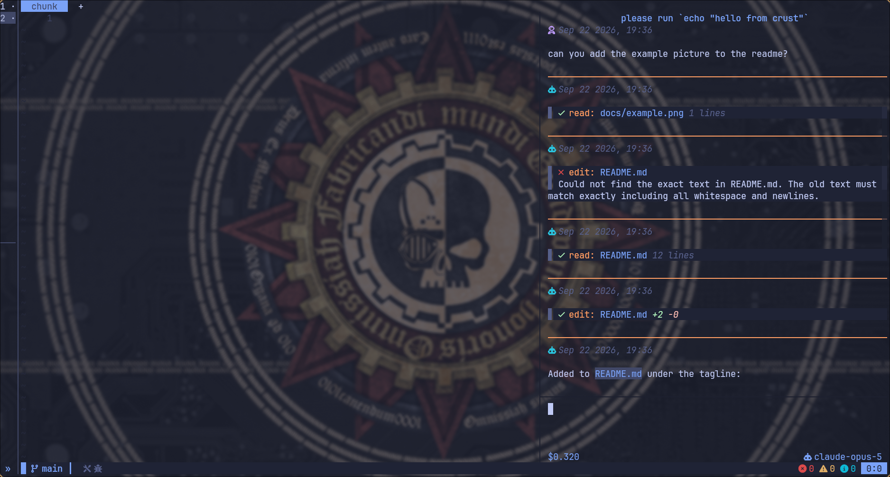

# crust.nvim

> [!WARNING]
> Early work in progress. API and commands may change.

A Neovim front-end for [PI](https://pi.dev)

## Requirements

- Neovim >= 0.13
- [snacks.nvim](https://github.com/folke/snacks.nvim) (optional, session picker with delete)
- [blink.cmp](https://github.com/Saghen/blink.cmp) (optional, popup completion in the chat input)
- [plenary.nvim](https://github.com/nvim-lua/plenary.nvim) (tests only)
