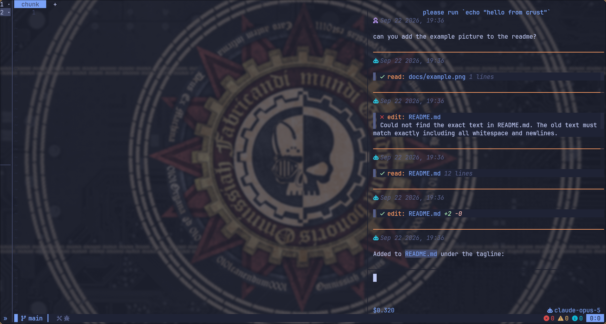

# crust.nvim

> [!WARNING]
> Early work in progress. API and commands may change.

A Neovim front-end for [PI](https://pi.dev)



## Debugging

`:Crust debug` (or `require("crust").debug()`) opens the raw rpc of every
live pi process in a new tab: the command each was spawned with, every line
sent, every line received, everything pi wrote to **stderr** — where provider
and auth failures actually say what went wrong — and the exit code.

```
09:05:11.412 $ pi --mode rpc  (cwd: /home/me/project)
09:05:11.430 > {"type":"prompt","id":"crust:2",…}
09:05:11.930 < {"type":"agent_start",…}
09:05:12.004 ! Error: OAuth refresh failed for anthropic: …
09:05:12.010 x pi exited with 1
```

Recording is always on and in memory, so a failure can be read after the
fact. `:Crust debug pretty` expands the json; `debug = { history = 2000 }`
caps how far back it goes, and `log = { enabled = true }` still writes the
same traffic to disk per session.

## Requirements

- Neovim >= 0.13
- [snacks.nvim](https://github.com/folke/snacks.nvim) (optional, session picker with delete)
- [blink.cmp](https://github.com/Saghen/blink.cmp) (optional, popup completion in the chat input)
- [plenary.nvim](https://github.com/nvim-lua/plenary.nvim) (tests only)
